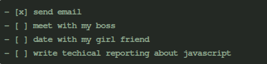

# Introduce Haroopad by Haroopad

[toc]

经常写技术文档，需要将文档像代码一样管理，例如可以提交SVN或者GIT，可以比对历史差异。用WORD之类的工具，文档不是纯文本，没法满足需求。用简单文本没有格式不美观。Latex最强大，但是对于一般文档撰写又太重量，配置一个好的模板太费神，而且标记有些复杂不好记。

如果你也有上述困苦，那么可以尝试一下Markdown！ Markdown是一种可以使用普通文本编辑器编写的标记语言，类似HTML，不过比HTML简单很多！ 用markdown撰写的文章可以直接转成HTML格式进行显示。 目前主流的博客系统都直接支持markdown，开源代码托管网站GitHub中readme文档撰写默认是markdown格式。 [Mardown语法](http://www.appinn.com/markdown/)非常简单, 基本十分钟可以全部学会！

为了让markdown支持更丰富的元素，不同组织和个人还开发了许多markdown扩展，例如可以支持表格、编程语言代码块、数学公式等等。

虽然markdown可以用任何文本编辑器进行撰写，但是使用专门的markdown编辑器，可以做到一边编写一边实时显示渲染效果。网上免费的markdown编辑器非常多，这里给大家介绍一款个人觉得最好用的markdown编辑器[Haroopad](http://pad.haroopress.com/user.html)！ 它是开源、免费、跨平台的，支持windows，linux和mac系统。Haroopad已经内置了各种markdown扩展，支持100多种编程语言代码的直接显示，例如C/C++， JAVA， C#， Ruby， Python， Erlang， Makefile等等，甚至代码显示的背景框都有很多主题可以选择。另外它支持撰写数学公式，支持一套文本绘图DSL，支持自动生成文档目录等等。Haroopad支持直接将文档发布成PDF格式。最后Haroopad支持用户自定义显示样式。 由于Haroopad是韩国人写的，所以用户手册里面很多都是韩语，所以这里将Haroopad的一些用法给大家介绍一下！

## Basic usage

Haroopad使用非常简单，左边是编辑区，右边是预览区。支持实时预览。

Haroopad支持所有的markdown标准语法。Markdown基本语法见[http://www.appinn.com/markdown/](http://www.appinn.com/markdown/)，基本上十分钟之内可以全部学会。

写好的markdown文稿保存成`*.md`文件。md文件是纯文本格式，可以用记事本打开直接阅读修改。在Haroopad下，可以将md文稿发布成带样式的html文件或者pdf文件。
> 发布成HTML格式:  文件 -> 导出到 -> HTML
>
> 发布成PDF格式： 文件 -> 打印 -> 打印到文件

## Code Block

对于程序员来说，最需要的就是对于Code Block的强大支持！ Haroopad支持100多种编程语言！每种语言的代码会按照语言风格进行编排缩进，以及语法高亮。

Code Block需要以`~~~`加上[编程语言标识符](http://pad.haroopress.com/page.html?f=how-to-write-fenced-code-block)的单独一行开始，以`~~~`单独一行结束。

例如对于一段C++的Code  Block。

显示结果如下：

代码块的背景框风格在Haroopad中可以配置：
> 文件 -> 偏好设置 -> Code -> 主题

Haroopad支持非常多的代码框风格，例如上面C++中的例子中配置的是sublime的风格。

## Image
在Haroopad中插入图片非常方便，如下：

小括号内分别是图片的url（可以是网络地址）、title以及图片的显示大小（单位px）。

## Table

Haroopad中绘制表格的语法如下：

显示效果如下：

## Tasklist

Haroopad扩展支持tasklist，语法如下：

显示效果如下：

## Math
Haroopad借助[Mathjax](http://www.mathjax.org/)扩展来支持对数学公式的显示。

为了让haroopad支持数学公式首先需要在配置里面开启数学公式支持：
> 文件 -> 偏好设置 -> Markdown -> 启用数学表达式
> 
> 

md文档中数学公式框需要以单独`$$`一行开始，并以`$$`一行结束，中间是符合Mathjax要求的数学公式：

显示效果：

## Diagram
Haroopad支持[mermaid](https://github.com/knsv/mermaid/wiki)扩展。Mermaid是一套绘图的符号语言扩展，支持绘制各种关系图，序列图。

Haroopad中mermaid绘图以`~~~mermaid`单独一行开始，以`~~~`单独一行结束。

显示效果如下：

其中`graph TD`指定绘图方向是从上而下，改为`graph LR`则是从左至右。

其它例子：

Mermaid扩展还支持其它绘图方式，以及调整绘图样式，具体见mermail介绍[https://github.com/knsv/mermaid/wiki](https://github.com/knsv/mermaid/wiki)

## Presentation mode
Haroopad支持直接撰写PPT。在撰写文档的时候以`***`做分页，在presentation mode下就会是独立的一页PPT。

要将文档以PPT模式显示，需要开启presentation mode：
> 视图 -> Presentation Mode

具体参见Haroopad关于Presentation Mode的说明: [http://pad.haroopress.com/page.html?f=how-to-write-presentation](http://pad.haroopress.com/page.html?f=how-to-write-presentation)

## Other features

- Haroopad支持对markdown语法的快捷键和自动补全。需要的话可以在偏好设置里面进行设置。

- Haroopad支持自动插入目录。具体在需要插入目录的地方插入空行和 `[toc]` 就搞定一切了。

- Haroopad支持丰富的媒体插入。例如音频和视频。

- Haroopad支持自定义编辑区和预览发布的样式，具体在 
	> 文件 -> 偏好设置 -> 编辑器 ->自定义主题 -> 编辑
	> 文件 -> 偏好设置 -> 预览 ->自定义主题 -> 编辑

	在弹出的目录里面有css文件，修改该css文件用来改变样式。每次修改css后需要重启haroopad。

## Extra

将md文件发布成pdf后，会发现Code Block背景框的风格变化了。该问题的解决需要配置haroopad的预览样式css文件，设置严格按照颜色样式打印就好了。如下：

## Summary

由于其简单易用，Markdown在社区已经越来越流行。甚至有些项目将自动化测试用例都用markdown语法来写，可以直接发布给客户当作说明文档，执行的时候靠一段解释代码将其翻译成目标语言执行，真的做到测试即文档。而Haroopad是一款非常强大的markdown编辑器，它内置的很多mardown扩展都是为了方便程序员，避免了大家到处寻找插件自行配制的繁琐。到目前为止haroopad是我找到的最好用的markdown编辑器，这篇文档就是用haroopad撰写。最后在支持如此多的特性后，haroopad依然非常轻量！ 希望Haroopad同样适合你！